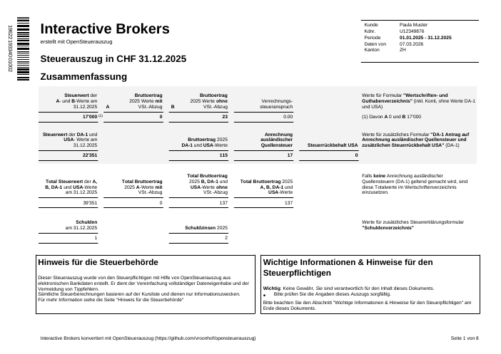
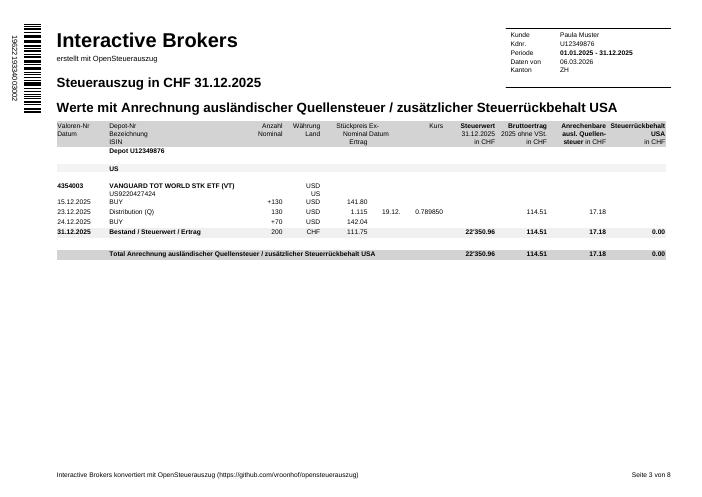

# OpenSteuerAuszug

A Python package for generating Swiss tax statements (Steuerauszüge) from the statements of brokers that don't support it, e.g. mostly foreign ones.
This goal is to eliminate tedious and error prone manual typing into the tax software.

## Disclaimer

- The package is not formally audited
- the main focus is on getting core transaction and interest data.
- These need to be verified by the user before submitting with the tax return
- Tax values are computed best effort for informational purpose (the main Tax software should be able to compute it from the core transaction data.

For more information on required due diligence see the the user guide.

## Usage

### Main usage case: Generating Steuerauszug from Broker Data

After installing, see the [User Guide](docs/user_guide.md) for preparation steps, how to get broker data and run the command.

### Verifying an Existing Steuerauszug

The tool can also be used to cross check and existing existing Steuerauszug (eCH-0196 XML). See See [verify instructions](docs/verify_existing.mdverify_existing.md).


## Features

- Import broker data provide transaction and position data in [ECH-0196](https://www.ech.ch/de/ech/ech-0196/2.2.0) compliant format.
- Perform simple tax approximations for informational purposes.
- Cross verify calculations against existing E-Steuerauszug data
- Create standardized formatted PDF that can be imported into Tax Software. 

## Sample Output

Below are previews from a sample Steuerauszug generated from the [VT and Chill](tests/samples/import/ibkr/vtandchill_2025.xml) IBKR test data.

| Summary page (p.1) | Stock table (p.3) |
|---|---|
|  |  |

[📄 Download full sample PDF](docs/sample_output.pdf)

## Supported Brokers

For now the focus is on brokers / banks that the author has 

- Charles Schwab (main trading account and Equity Awards)
- Interactive Brokers
  
Additionally we can recalculate and verify any existing steuerauszug (this is mostly to increase confidence in the software itself)

## Related work and alternatives

[Datalevel](https://www.datalevel.ch/en/) offers a very [similar solution for IBKR](https://www.datalevel.ch/en/loesungen) as a paid service (reasonable yearly flat fee). It is a SaaS solution that requires online access to the flex API for your account. They are from the SWIS banking ecosystem so they use the shared Java rendering libraries which makes things look a bit more standard. They suffer from of the same issues as well, like this project they are not actually the offical bank. If you need no hassle, this could be it.

[zh-tax-csv-import](https://github.com/stefanloerwald/zh-tax-csv-import) is a chrome extension also imports Schwab and Interactive Broker statements, but then fills in directly on the tax forms. This is less clean and more brittle, but once done the Tax office sees no difference to manual entry. As an upside the tax declaration remains an authorative list of all your investments and accounts. 

Agentic browsers are getting very close just be able to do the above all by themselves.

The [EWV](https://www.ewv-ete.ch/de/ewv-ete/) and SSK publish a [shared set of tools](https://forum.mustachianpost.com/t/programmatic-tax-return/11908/69) that is even referenced in the spec. This used to availabe online, but is now locked down to a cabal of banks and tax officials. Inquiring minds however have noticed that the JAR is [included in nearly every offline official Tax software](https://mkiesel.ch/posts/swiss-tax-adventures-1/). It includes an official sample renderer for the PDF version given an XML file, so you could also use that instead of the python renderer. It will look a bit more official. I wasn't aware this existed and had to recontruct from scratch as well as fix a lot of the python PDF417 libraries. The spec refers to the library as open source but non of these actually include the source.

## Installation

Requires **Python 3.10** or newer.

This needs newer version of pdf417gen and (for testing) pdf417decoder than
available on PyPY for now there are my vendored branches

In the current development phase it is best to install direct from git. e.g.

```console
# Clone the repository
git clone https://github.com/vroonhof/opensteuerauszug.git

# Navigate into the cloned directory
cd opensteuerauszug

# --- Virtual Environment Setup ---
# Create a virtual environment
python3 -m venv .venv

# Activate the virtual environment
# On macOS and Linux:
source .venv/bin/activate

# On Windows (use this command instead):
# .venv\Scripts\activate

# --- Install the package ---
# Install the package and its dependencies using pip
# The '.' indicates to install the package from the current directory
# The '[dev]' part is optional and installs development dependencies as well
pip install .[dev]

```

This package needs a needs newer version of pdf417gen and (for testing) pdf417decoder than available on PyPY. Either install them directly from git ot use my vendored branches (e.g. `git+https://github.com/vroonhof/pdf417-py.git`)

### Verifying the generated XML

When you export the final XML using `--xml-output`, you can validate it
against the official eCH-0196 schema with common XML tools.  Examples:

```bash
# Using libxml2
xmllint --noout --schema specs/eCH-0196-2-2.xsd output.xml

# Using a Java based validator (Jing)
java -jar jing.jar specs/eCH-0196-2-2.xsd output.xml
```

## Scripts and Tools

This project includes various scripts for data processing, testing, and utility tasks.
For detailed documentation on available scripts, including the Kursliste filtering tool, see the [Scripts Readme](scripts/README.md).

## Development

### Setup

To set up the development environment:

```bash
# Create and activate virtual environment
python -m venv .venv
source venv/bin/activate  # On Windows: venv\Scripts\activate

# Install dependencies
pip install -e ".[dev]"
pip install git+https://github.com/vroonhof/pdf417decoder.git#subdirectory=python
```

### Testing

```console
pytest tests/
```

If the environment variable `EXTRA_SAMPLE_DIR` points to a directory with XML files these are validated as part of a set of integration sets. See the [verify](docs/verify_existing.md) documentation for how to invoke that manually.

### Developer Scripts

This project includes utility scripts for development and data management. For detailed information on these scripts, please see the [Scripts Documentation](scripts/README.md).


### Code quality and AI usage.

This project exists in part for me to try out AI based coding outside of $WORKPLACE to try out various tools. As a result code quality and style is inconsistent and contains various AIisms. Code has been cleaned-up, reviewed and controlled by me where it matters.

That said all mistakes, hallucinations etc are probably mine.

## Related projects

- https://github.com/stefanloerwald/zh-tax-csv-import : if you want an
  automated import that controls PrivateTax directly. It is more hacky but leaves no trace for the tax office to be confused about.
- https://github.com/BrunoEberhard/open-ech-taxstatement : An old project I only discovered later that contains a model defintion of the Tax data targeting Java. The author has since left the Swis open data efforts.


## License

See [LICENSE](LICENSE) file.

Though I am not formally requiring it to keep things simple, I would prefer if you dropped me a line if this package being used or included in other software or other service (e.g. if you are financial service provider).

